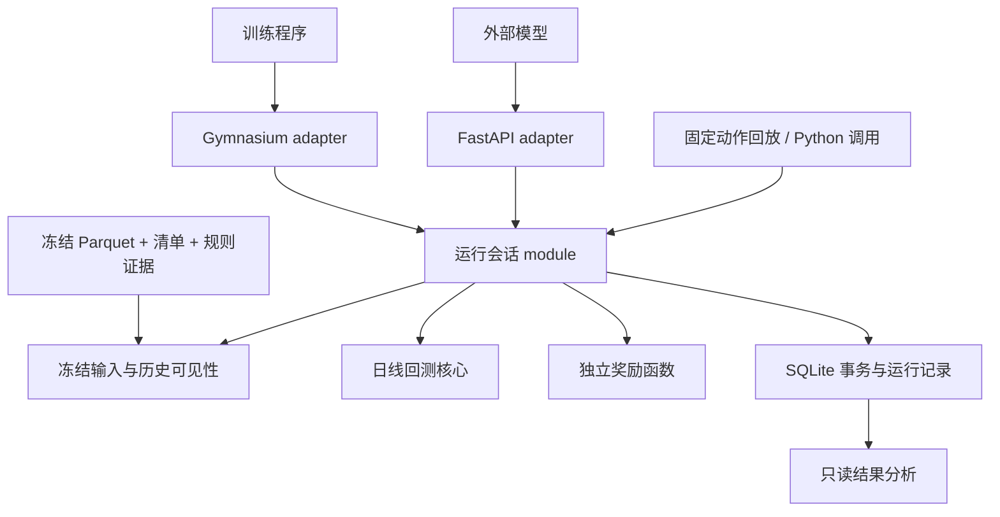

# A 股日线回测系统：项目框架与选型

版本：v0.2。日期：2026-10-04。依据：[1.spec.md](1.spec.md)。状态：经本次评审修订的推荐架构，尚未实现或运行验证。第一版的具体执行选择见 [execution-v1](3.EXECUTION_POLICY_V1.md)；它是本次设计决定，不追溯改写用户原先确认的需求。

开发入口：[4.DEVELOPMENT_PLAN.md](4.DEVELOPMENT_PLAN.md) 按 Matt 七阶段补充任务依赖、恢复原型及验收映射；正式实现进度以其中的里程碑和任务记录为准。

**推荐采用 Python 模块化单体：自有日线回测核心 + Gymnasium 训练适配 + FastAPI 本地接口 + 冻结 Parquet 输入 + SQLite 运行记录。** 第一版不整体依赖某个量化框架来管理权威账户；借鉴 Qlib 的决策与执行分离、RQAlpha 的账户语义、TensorTrade 的奖励分离。

选择自有核心的理由是本项目的特殊规则集中在账户和执行语义上：T 日冻结计划、次日开盘条件、先买后卖、有限现金共同缩减、权益到账、失败恢复。这些在所调查项目中仍需要专门实现或改写。这里的“自有”仅指这段必要的领域逻辑，HTTP、训练协议、文件读取和事务仍使用成熟基础库。

## 1. 要做的产品

这是一个供外部模型使用的逐日模拟账户。模型决定目标组合和买入区间，系统完成一次完整交易日，并返回真实模拟账户、执行事实和奖励。第一版成功标准是 [1.spec.md](1.spec.md) 的 A01–A19 通过，而不是已有策略能跑出收益曲线。

必须在框架层守住以下规则：

- T 日收盘后决策，用当时可知总资产和参考价冻结计划数量。T+1 开盘价只用于检查买入区间、交易限制、成交候选价及资金可行性；实际数量可因约束少于计划，不得据此改写目标权重。公司行动的有依据调整单独记录。
- 先买后卖。零现金时，即使本轮即将清仓 A，也不能先用该笔卖款买 B；卖完当天不补买。
- hold 与 rebalance 分开；完整组合中遗漏的持仓目标为零，缺失请求不能解释成清仓。
- 买入区间只检查下一交易日开盘，不转成等待日内触发的普通限价单。
- 回测核心只产出客观事实；奖励读取事实，不能改变账户。
- 同一核心供 Python、HTTP、训练和固定动作回放使用；不允许各入口维护自己的撮合逻辑。
- 数据或规则未知要暂停；已知停牌等交易限制仍可形成正常的一日转移。

首次调研时工作区只有 spec.md（现名 1.spec.md）；当前已有设计与开发计划，并已初始化 Git、连接 GitHub 远端，尚无正式业务代码或依赖文件。规格中的 ../../CONTEXT.md、旧账户示例等引用在当前相对位置不存在。旧项目能力仅是规格提供的背景，尚未核验其实际实现。本文不要求重建旧采集库，也不假定已有冻结包已经合格。

## 2. GitHub 同类项目调研

调研以官方仓库、源代码及官方文档为依据，查阅日期为上方日期。以下是文档和源码分析，没有安装项目跑对比实验。分支链接可能变化，正式引入代码前应锁定提交并验证。表中的“不采用”是本项目的成本判断，不表示相应框架无法扩展。

| 项目 | 已核验的相关能力 | 与本规格的差异及采用决定 |
|---|---|---|
| [microsoft/qlib](https://github.com/microsoft/qlib) | 区分决策、执行、账户；有 RL Simulator 抽象及逐步执行机制；执行器可以控制订单顺序 | 最有价值的分层参考。但默认目标组合规划、现金分配和行情回退不等于本规格。第一版不让 Qlib 管理权威账本，后续有具体研究需要时再接入 |
| [ricequant/rqalpha](https://github.com/ricequant/rqalpha) | A 股账户、目标组合、分红、拆股、可卖数量，以及可替换的数据源与 broker | 市场账户参考价值高；现成组合 API 先提交卖单、后提交买单，并将预计卖款纳入买入预算，核心语义冲突。授权条款也需单独核对。第一版不整体依赖 |
| [AI4Finance-Foundation/FinRL](https://github.com/AI4Finance-Foundation/FinRL) | 股票训练环境、reset/step 和训练示例 | 所查 StockTradingEnv 的股数动作、先卖后买、收盘成交和奖励口径均不同。参考训练调用方式，不继承其账户逻辑 |
| [tensortrade-org/tensortrade](https://github.com/tensortrade-org/tensortrade) | 可组合动作、观测、奖励和环境 | 参考奖励与动作解释的分离；完整 scheme 体系对当前单一日线流程偏重，不照搬全部抽象 |
| [mementum/backtrader](https://github.com/mementum/backtrader) | 目标仓位订单、订单类型、费用和 broker 模拟 | 可作订单表达参考；开盘一次性条件、共同现金缩减、权益明细及 HTTP 幂等仍需专门构建，暂不作为核心 |
| [polakowo/vectorbt](https://github.com/polakowo/vectorbt) | 批量回测、组合分析；也支持依赖账户状态的自定义订单函数 | 后续批量研究可评估。第一版重点是逐步交互和可审计账户，加入其回调体系的收益暂不足以覆盖适配成本 |

### 2.1 几个影响选型的源码事实

**Qlib 可以实现先买后卖，不能因默认示例而说它不支持。** SimulatorExecutor 的 serial 保持传入顺序，parallel 会将买单放在前面；但默认目标订单生成路径返回卖单再买单。OrderGenWOInteract 虽以前一预测日收盘计量，仍检查交易日可交易状态；Exchange 还有可交易权重归一及价格回退路径。因此本项目需要自己的 T 日规划、时间准入及严格执行规则。依据：[执行器](https://github.com/microsoft/qlib/blob/main/qlib/backtest/executor.py)、[订单生成器](https://github.com/microsoft/qlib/blob/main/qlib/contrib/strategy/order_generator.py)、[Exchange](https://github.com/microsoft/qlib/blob/main/qlib/backtest/exchange.py)、[RL Simulator](https://github.com/microsoft/qlib/blob/main/qlib/rl/simulator.py)。

**RQAlpha 的组合 API 会利用卖出款。** order_target_portfolio 先提交卖单再提交买单；smart 路径也把预计 sell_proceeds 加入 buy_budget，并按约束调整组合。它已区分估值价格与下单价格，不能说它不支持前收盘计量、开盘执行。但这些现成组合 API 不可直接替代本规格动作。依据：[股票 API](https://github.com/ricequant/rqalpha/blob/master/rqalpha/mod/rqalpha_mod_sys_accounts/api/api_stock.py)、[smart 组合 API](https://github.com/ricequant/rqalpha/blob/master/rqalpha/mod/rqalpha_mod_sys_accounts/api/order_target_portfolio.py)。

RQAlpha 的账户实现包含现金分红应收与派息日到账、拆股、可卖数量；是否完整覆盖本规格要求的股份入账日与可卖日分离，仍需专项验收。其仓库现有授权包含非商业与组织使用等条件，不能仅按普通 Apache-2.0 依赖处理。依据：[账户源码](https://github.com/ricequant/rqalpha/blob/master/rqalpha/mod/rqalpha_mod_sys_accounts/position_model.py)、[LICENSE](https://github.com/ricequant/rqalpha/blob/master/LICENSE)。本文仅借鉴思路，没有复制项目代码。

**FinRL 所查股票环境不是所需账户语义。** action 乘 hmax 后转为整数股数；卖出先于买入；使用当前状态的 close 成交再推进日期；奖励是资产金额差乘缩放系数；日期耗尽返回 terminated 而非 truncated。这些结论限于该实现，不推广到所有 FinRL 环境。依据：[StockTradingEnv](https://github.com/AI4Finance-Foundation/FinRL/blob/master/finrl/meta/env_stock_trading/env_stocktrading.py)。

TensorTrade 的 TradingEnv 组合 ActionScheme、RewardScheme、Observer、Stopper、Informer、Renderer；SimpleProfit 的单步收益形式接近本项目，但示例中的 PBR 不能代替扣费后账户收益。依据：[环境](https://github.com/tensortrade-org/tensortrade/blob/master/tensortrade/env/generic/environment.py)、[奖励](https://github.com/tensortrade-org/tensortrade/blob/master/tensortrade/env/default/rewards.py)。

Backtrader 的 order_target_percent 确实表达组合价值比例，但普通 Limit 可以在交易时段内触发，并非本项目的开盘一次性条件。VectorBT 的 from_order_func 确实可以根据状态执行自定义逻辑，不应把它误判成只能消费预先计算的信号。依据：[Backtrader 目标订单](https://www.backtrader.com/docu/order_target/order_target/)、[broker 源码](https://github.com/mementum/backtrader/blob/master/backtrader/brokers/bbroker.py)、[VectorBT 组合文档](https://vectorbt.dev/api/portfolio/base/)。

## 3. 用 matt 的 Design It Twice 比较三种框架

应用的 skill 是 [codebase-design](C:/Users/zhj54/.codex/plugins/cache/openai-curated-remote/matt-skills-curated/1.1.0/skills/codebase-design/SKILL.md)，并使用其 [Design It Twice](C:/Users/zhj54/.codex/plugins/cache/openai-curated-remote/matt-skills-curated/1.1.0/skills/codebase-design/DESIGN-IT-TWICE.md) 和 [Deepening](C:/Users/zhj54/.codex/plugins/cache/openai-curated-remote/matt-skills-curated/1.1.0/skills/codebase-design/DEEPENING.md)。已并行推演以下三个候选。

| 候选 | interface 形态 | depth / locality / seam | 取舍 |
|---|---|---|---|
| A：自有逐日账户 module | reset(config)、step(request)、read(run_id) | 小 interface 隐藏完整交易日；账户规则集中；外部接入通过同一 seam | 推荐。需要自行实现必要账户规则，但验证面最直接 |
| B：已有框架组合 | FrameworkRun.open(...)、observation()、advance(action) | 外部 interface 可以很小；内部规则跨自定义规划、框架执行、账户扩展与持久化 | 复用生态多，但当前特殊规则适配广，locality 较弱 |
| C：训练环境作为核心 | env.reset(...)、env.step(action)、env.close() | 训练调用最短；若环境拥有账本，HTTP 幂等和恢复也会进入 Gym 生命周期 | 采用其调用体验，将 Gym 留作 adapter，不让它拥有账户规则 |

候选 A 将数据和状态交给自己的一日计算，返回不可变结果；候选 B 将动作转换为框架订单并接管回调；候选 C 将调用者直接置于 Gym 的 episode 循环。三者的控制权位置不同，不只是类名不同。

最终选择 **A 的核心 + C 的训练入口**。借鉴 B 的设计经验，但不引入框架兼容层。基础逻辑很明确，适合先做窄而完整的 module。

具体遵守以下设计约束：

1. **深模块、小接口**：外部不依次调用买入、卖出、扣费、解冻、估值；只提交一次 step。
2. **删除测试**：删掉日线 module 会让账户规则散到 HTTP、训练和回放三处，说明它有价值；删掉一层纯转发包装若反而简化调用，就不保留该包装。
3. **真实 seam 才抽象**：HTTP 与 Gym 是实际调用场景。首版冻结包和 SQLite 都只有一种实现，直接使用具体 module，不建立通用 DataProvider、BrokerFactory 或 Repository 基类。
4. **依赖分类决定测试**：计算属于 in-process；Parquet、SQLite 属于 local-substitutable，使用临时真实文件验证。运行中的核心无需远程行情依赖。
5. **公开 interface 就是测试面**：A01–A19 通过 reset/step 或 HTTP 验收，不靠读取私有字段或模拟内部扣款调用次数。

## 4. 模块职责与依赖方向



箭头表示调用或数据流。奖励和存储都不能反过来修改核心中的候选账户；核心不导入 Gymnasium、FastAPI 或奖励实现。

| module | 自己负责的复杂性 | 主要 interface |
|---|---|---|
| market | 数据包身份、历史可见性、证券映射、资格与缺失、决策/执行资料隔离 | 构造 DecisionView 与 ExecutionDay |
| simulation | 计划数量、开盘条件、共同现金预算、先买后卖、历史规则、权益和估值 | plan_at_close(...)、advance_day(...)，均返回值 |
| session | reset/step 生命周期、动作校验、暂停、恢复、调用奖励、提交完整结果 | Backtest.reset、step、read |
| storage | 请求内容绑定、唯一约束、账户版本检查、原子提交、读取运行 | 具体 SQLite 操作，隐藏 SQL 与事务细节 |
| rewards | 根据不可变 StepFacts 计算分数 | daily_net_return(facts, parameters) |
| gym_env / api | 数组或 HTTP 与规范契约的映射 | Gym 五元组 / HTTP 请求响应 |
| reporting | 从已提交账本计算指标、导出结果和限制说明 | build_report(run_record) |

session 属于环境/应用编排层，simulation 属于客观回测核心。这样两种接入都能得到 reward，而回测计算本身不依赖任何奖励算法。奖励选择先用普通函数及小型名称映射，不建立插件加载系统。

首个奖励为本步结束总资产 / 上步结束总资产 - 1；资产已扣费用，不再次扣费，也不单独惩罚买入失败。末步资产非正时，以上步正资产完成末步计算再终止；数据故障导致净值未知时不给零奖励。奖励只能读取不可变事实；未来若加入有状态奖励，其状态也必须纳入候选结果与同一次提交。

simulation 内部先保留少量紧密相关函数。数量、费用和现金约束不要拆成互相转发的小类；只有出现独立复杂度后才拆文件。需要配置的仅是规格已要求的设置，例如费用规则版本、滑点、决策时间和奖励参数。

## 5. 公开契约

以下均为拟定 interface，不是已经存在的实现。

```python
backtest = Backtest(package=frozen_package, runs_dir="runs")
initial = backtest.reset(config)  # 总是创建新 run，不覆盖旧实验

reply = backtest.step(StepRequest(
    run_id=initial.run_id,
    step_id=0,
    request_id="action-0001",
    action=Rebalance(targets=(
        Target(symbol="600000.SH", target_weight=Decimal("0.10"),
               buy_open_lower_return=Decimal("-0.02"),
               buy_open_upper_return=Decimal("0.01")),
    )),
))
record = backtest.read(initial.run_id)
```

此处证券仅为动作结构示例。初始化返回 start_date 前一交易日的决策状态；start_date 是首个执行日。按 execution-v1 对齐非交易日，reset 同时返回 requested_start_date、requested_end_date、actual_start_date、actual_end_date、initial_decision_at 和用途限制；空区间或缺前一决策时点资料均拒绝。已有 run 由持久化记录恢复，不使用 reset 恢复旧账户。read 返回状态、复现身份及结果记录的只读视图。

关键值类型：

- **RunConfig**：请求日期、资金、股票范围、决策时刻、数据与规则身份、成交及费用设置、policy_id=execution-v1、奖励选择、种子。保存全部解析后的实际参数与哈希，不能只保存策略名称。实际对齐日期另存。
- **Action**：Hold 或 Rebalance；后者是完整目标集合。非法输入整体拒绝，核心不静默归一化权重。
- **DecisionView**：截至 decision_at 可见的历史字段、参考价和已知状态。
- **PriceBasis**：价格口径、币种、所属交易日和公司行动调整身份的值记录。首版执行使用真实价格；跨除权日需核验并记录基准转换，缺依据暂停。不建立通用复权转换框架。
- **Plan**：冻结动作、T 日资产与价格基准、计划买卖数量、原始区间及绝对边界。只能由 T 日信息产生。
- **ExecutionDay**：推进到下一交易日后才交给执行计算的开盘、状态、权益事件和收盘估值资料；不进入此前 observation。
- **StepFacts**：前后账户值、订单、成交、费用、权益流水、估值及限制；以不可变值传给奖励。
- **StepResponse**：下一 observation、reward、terminated、truncated、info。账户类值与训练数组分开。

HTTP 只映射四项操作：POST /runs、POST /runs/{run_id}/steps、GET /runs/{run_id}、GET /runs/{run_id}/results。运行身份以路径和正文一致性为准，时间由环境产生；模型不能在请求中改变执行日。

### 5.1 校验归属

| 位置 | 必须校验的内容 |
|---|---|
| contracts：无状态值校验 | hold 不附目标；rebalance 目标字段必填，允许显式空集合；权重有限且各在 [0,1]、总和不超过 1；拒绝重复证券、NaN、Infinity、负权重及非法类型；区间两端成对出现、有限，下限 > -1 且小于上限 |
| session / storage：运行一致性 | run、步号、请求身份、规范内容哈希、绑定状态及可恢复身份；缺请求、模型超时或格式错误不变成 hold/清仓，也不推进日期 |
| market：输入资格 | 稳定证券身份、时区、available_at、历史版本、价格口径、实际覆盖与用途证据 |
| simulation：状态相关校验 | 根据持仓和 T 日目标推导买卖方向；产生买入的目标必须有有效区间；减仓时区间不参与成交条件；完整组合未列出的持仓目标为零，空组合尝试清仓 |

提供了区间就校验它的结构，即使本轮最终是减仓；但不给纯减仓强加买入区间。产生买入的判断依赖账户，不能仅靠 contracts.py 的字段校验完成。区间允许全部在参考价上方或下方；按 execution-v1 用 Decimal 做严格边界比较。HTTP 与本地 Python 共用同一条领域校验路径，不能只在 HTTP 中检查。

### 5.2 查询与训练映射

read / GET /runs/{run_id} 返回最后已提交账户、next_step_id、run_status，以及待恢复的 bound_step_id、bound_request_id、冻结的原请求/动作、base_version、last_error 和 recovery_action。recovery_action 取 RETRY_ORIGINAL、NEW_RUN_REQUIRED 或 NONE；不再另存一个可能冲突的 retryable 布尔值。没有待恢复请求时相应字段为空。

我保留“同一步不同 request_id 返回冲突”的设计，并提供上述查询恢复路径。调用方丢失 ID 后可以取回原请求并重发，不必新造动作或新增 resume 接口。这是本次可靠性策略，不能冒充 spec 原先已逐项规定的行为。查询只返回已提交账户，不把未提交候选状态或未来执行诊断混入模型 observation。

Gym adapter 提供 reset(seed, options) 与 step(action)。证券顺序、动作映射版本及观测形状在 episode 内固定；明确编码 hold，不能将全零目标自动当作 hold。先接收规范动作完成验收，再实现训练数组映射。映射可以显式构造合法权重，领域入口仍独立校验。遵守 [Gymnasium Env 契约](https://gymnasium.farama.org/api/env/)，按 execution-v1 分别计算窗口截断与任务终止；数据故障不是伪造的正常 transition。

## 6. 一次 step 的计算与提交

1. 读取请求身份并查记录。相同 request_id 已成功提交且规范内容相同，直接返回原响应；内容不同则拒绝。**先做成功幂等查询，再做过期步号或已结束检查。** JSON 字段顺序、目标列表排列及等价十进制写法不改变规范内容；同标识换实质动作必拒绝。保存收到的原文以便审计。
2. 校验动作、当前 step 和运行状态，完成只使用 T 日信息的规划及状态相关校验；在读取任何 T+1 资料前，用短事务持久化唯一 (run_id, step_id) 的决策绑定：原动作及规范化哈希、T 日 observation/Plan 的身份、账户 base_version 和原 request_id，同时绑定请求内容。同一步其他 request_id 不得更换该决策，首版统一返回冲突并要求重试原请求。这只是不可改决策记录，不推进账本。
3. 推进候选模拟时钟并取得 ExecutionDay，完成所需执行、估值和下一观察资料的预检。未知关键规则或行情导致暂停，已提交账户保持原值。
4. 在候选状态中处理有依据的权益事件与可卖变化；必要时按已核验规则调整 Plan，不根据次日价格重新定义目标。
5. 批量判断买入区间、交易限制、成交候选价与费用，按买入阶段起始可用现金形成全部买入数量，再执行买入。
6. 执行卖出。卖出款进入候选账户，但不回到买入阶段。
7. 收盘估值，确认权益与守恒关系，生成不可变 StepFacts 和下一 observation。
8. 环境编排层调用独立奖励函数，校验结果并构造完整 StepResponse。
9. SQLite 单事务提交动作、Plan、订单、成交、权益、账户、步号和完整响应；成功后才发布新的内存状态和响应。

这里的候选计算没有对外部账户的副作用。奖励失败时不提交账本、不推进 step；保存诊断和请求内容绑定，同内容可安全恢复。无需先提交账户再维护一套 reward_pending 状态。换奖励实现或输入版本属于新实验，不能悄悄修改旧 run 的身份。

同 run 的进程内锁减少重复工作；数据库中的唯一请求绑定、唯一决策绑定、唯一成功 (run_id, step_id) 与账户版本条件更新保证决策不能换、账本不会重复提交。最终事务必须再次查询已成功响应、决策绑定及账户版本，并确认 run 仍为 ACTIVE/PAUSED，处理并发纯计算与提交后响应丢失；已经被判定 FAILED 的 run 不能被旧候选继续提交。SQLite 自身提供事务原子性，但请求去重和账户版本检查仍由本项目实现。依据：[SQLite 事务](https://www.sqlite.org/lang_transaction.html)、[原子提交](https://www.sqlite.org/atomiccommit.html)。

### 6.1 持久化状态与恢复

run 状态为 ACTIVE、PAUSED、FINISHED、FAILED。当前 step 没有绑定记录即为未绑定；建立决策记录后为 BOUND，完整提交后为 COMMITTED。ACTIVE 不代表一定允许新动作：ACTIVE + BOUND 只能继续原请求。reset 成功直接产生 ACTIVE；不增加没有独立恢复意义的 CREATED 状态。

EXECUTION_READ、CALCULATED 是纯候选计算的内存阶段，不逐阶段持久化。绑定本身已经禁止换动作，因此无需靠持久化“是否读过未来资料”决定还能不能改动作。进程恢复从冻结 Plan 和基准账户重算，不能复用来源不明的半成品。

| 起始情况 | 事件 | 持久化结果 / 恢复行为 |
|---|---|---|
| 无 run | reset 校验、初始化成功 | ACTIVE，next_step_id=0，无决策绑定；初始化原子完成 |
| ACTIVE、当前步未绑定 | 非法动作或时序错误 | 拒绝，仍未绑定，账户不变；允许提交纠正后的动作 |
| ACTIVE、当前步未绑定 | 合法动作 | 短事务写 BOUND 与原请求、Plan、base_version；账本和步号不变 |
| ACTIVE/PAUSED + BOUND | 原请求、原内容、原运行身份重试 | 从冻结决策及基准账户计算；不另建交易步 |
| ACTIVE/PAUSED + BOUND | 其他请求标识或不同内容 | 冲突；通过 read 取回原请求，不能覆盖绑定 |
| ACTIVE/PAUSED + BOUND | 计算与奖励成功并提交 | 同事务写 COMMITTED、账本、完整响应、步号加一；run 变 ACTIVE 或 FINISHED |
| ACTIVE/PAUSED + BOUND | 数据、奖励、暂时 I/O 或尚未明确的内部异常 | 有条件地记 PAUSED 与原因、恢复动作；账户和步号不变 |
| 可运行状态 | 已证实无法信任内部记录，无法按原身份继续 | FAILED，保留既有账本与诊断；禁止新交易，不以普通异常代替此判定 |
| 任意状态，包括 FINISHED/FAILED | 已提交原请求的同内容重试 | 返回原响应，不恢复交易、不改变状态 |
| 尚未提交、需要计算或续跑 | 调用者环境的软件/数据/奖励身份不匹配 | 拒绝该调用；不因调用者环境不匹配就把旧 run 标为 FAILED |

已提交响应直接从持久化记录读取，不因当前计算环境版本变化而重新计算；请求本身内容或声明的运行身份不同，仍按内容冲突拒绝。重新运行计算才需要当前环境与原 run 的执行身份一致。

异常落库也必须条件检查 run 仍为 ACTIVE/PAUSED、base_version、绑定请求和 step=BOUND。并发重算中若另一请求已完成提交，迟到的失败不得把 run 从成功改回 PAUSED；应优先读取已提交响应。若存储故障使诊断本身无法写入，不能声称已保存 PAUSED；保留最后已提交状态，可写日志记录故障，恢复时以数据库事实为准。

PAUSED 与“可重试”不是同义词：同内容文件暂不可读、相同代码下的临时故障，可标 RETRY_ORIGINAL；冻结包缺必需资料、必须改代码/奖励才能修复，标 NEW_RUN_REQUIRED。恢复前核对数据、代码、策略、奖励、依赖等已保存身份；不能仅凭“我认为结果不变”续用旧 run。execution-v1 的成交滑点确定且不随机，重试不重新抽结果。

### 6.2 对调用者的错误契约

错误契约：

| 情况 | 是否推进 | 返回与恢复 |
|---|---|---|
| 非法动作、步号或请求内容冲突 | 否 | 明确校验/冲突错误，不解释成 hold |
| 区间失败、无现金、已知停牌等 | 是 | 正常 StepResponse，订单原因及真实资产收益 |
| 数据、规则或估值故障 | 否 | 暂停诊断，不返回可训练的伪样本 |
| 奖励失败、提交前异常 | 否 | 保存失败原因，绑定原动作后允许安全恢复 |
| 已提交但响应丢失 | 已推进一次 | 原请求重试返回已持久化响应 |

读取执行资料后发生暂停，不能借更换 request_id 改写同一步的冻结动作，以免用已看到的未来信息重新决策；恢复沿用该动作，或明确另开实验。修复冻结包形成新输入身份，不在原 run 中覆盖文件。

## 7. 数据、数值与运行记录

### 7.1 两条资料通道

模型只接收 DecisionView 生成的 observation；执行器使用 ExecutionDay。即使为了速度预载整个包，也不能把原始全量表交给模型或特征构造函数。

可见性检查逐字段使用 available_at 和历史版本；行情日期不等于可用日期。证券筛选、缺失掩码、归一化统计也必须遵守此约束。观察中不放整包根哈希、未来缺失统计或次日交易资格，避免 A11 因元数据或筛选发生泄漏；根哈希放复现记录中。固定证券映射不能根据下一日停牌或未来上市退市结果悄悄改变。

冻结输入逻辑上至少包含：清单与文件哈希、交易日历、证券身份与板块历史、决策字段及 available_at、真实价格口径的执行/估值资料、历史费用与数量/价格限制规则、公司行动和资格证据。这是内部契约要求，不是对旧数据包实际字段的断言；接入旧项目时再核验字段映射。

规则同时保留适用时间与证据/可用时间。规划只能使用 T 日可知规则；执行应用实际适用规则并留痕。费用、手数、涨跌停、可卖规则不写成全市场通用常量。跨除权日无可核验调整依据就暂停；复权价格或复权因子不能代替真实现金与股份流水。

真实输入可正式使用、仅能受限复现，还是仅供合成验收，由证据和用途检查决定。formal_backtest_allowed=false 的旧包不能因接入新框架而变成 true。市场目标是 A 股，首批实际覆盖必须单独列出。

### 7.2 计算规则

金额、价格、费用和区间比较使用 Decimal；数量用整数并按历史数量规则验证。明确记录内部精度、各项舍入时点与规则，不能在每个中间步骤随意四舍五入。HTTP 的精确小数采用约定的十进制字符串，Python 保持 Decimal，只有训练映射转换为数值数组，模型无需从 JSON 文本学习。[Python Decimal 文档](https://docs.python.org/3/library/decimal.html) 支持十进制运算，但精度政策仍须由本项目明确。

execution-v1 采用共同缩放断点算法，定义、精确伪代码及手算例子见[执行策略第 3 节](3.EXECUTION_POLICY_V1.md#3-d01-的确定算法)。费用和合法数量已经包含在资金搜索中，不执行“超支后逐股微调”或余款再分配。输入排列不影响按证券对应的结果，每单都不超过冻结计划上限。费用按每笔逻辑成交订单计收一次，具体分组键和准入要求见[价格与费用前提](3.EXECUTION_POLICY_V1.md#2-价格与费用前提)。

账户现金区分可用与冻结，应收权益单列；持仓区分已持有与可卖。到账与股份入账只是资产类别转换。卖出所得本轮不补买，未成交不收费。停牌估值可用明确标记的陈旧值，成交不能使用陈旧值。

公司行动使用有版本和来源证据的规则/事件记录，独立验收登记、权益确认、除权、现金到账、股份入账与可卖时点。应收现金只在实际到账后增加可用现金；股份入账与变为可卖分别更新；已确认权益转成现金/股份时冲减原权益，防止总资产重复增加。跨日 Plan 调整与模型原动作分开保存，未知日期或调整依据暂停。先实现现金权益与股份权益的具体处理，不建立通用事件插件引擎。

### 7.3 记录与复现

每个 run 使用独立目录及一个 SQLite 文件，数据库是权威记录。原始动作、解释后的 Plan、逐笔事实、每日账户、完整响应、错误诊断、配置与身份都能追溯；JSON/Parquet 报表是提交后可重新生成的导出物，不与数据库形成第二份权威账本。

复现身份记录数据根哈希、规则和时间策略、成交/费用/精度设置、证券映射、代码版本或源码哈希、依赖锁、奖励与动作映射版本、种子。实施时记录实际 Git 提交或源码身份，不能为尚未实现的代码或依赖填写虚构版本。相同输入的固定动作回放，与重新调用模型产生动作，是两种不同实验。

报告包含累计/年化收益、最大回撤、费用、换手、失败原因、现金比例及最终持仓，明确年化和换手口径。奖励累计不冒充账户收益；无合格基准不造超额收益；结束默认保留持仓。所有报告带数据资格、日线开盘近似与容量限制。

训练、验证、测试按时间划分，预处理只在训练段拟合。历史规则和退市证券覆盖等事实由数据检查承担，不能靠一次代码验收代替。

## 8. 技术栈决定

| 用途 | 选择 | 理由与限制 |
|---|---|---|
| 主语言 | Python；建议以 3.12 建首个环境 | 与模型和训练直接交互；具体依赖组合需在落地时做导入与平台验证，不声称已验证 |
| HTTP 与契约 | FastAPI + Pydantic 2 | 校验、序列化和 OpenAPI；交易规则仍放 simulation/session |
| 训练协议 | Gymnasium + NumPy | 标准交互及数值映射；不绑定某个训练算法 |
| 冻结输入 | PyArrow 读取 Parquet | 沿用已有冻结包方向；按需要的范围和列读取 |
| 运行记录 | 标准库 sqlite3，每 run 一个库 | 本地事务、幂等和恢复，不引入数据库服务器 |
| 金额与时区 | Decimal、zoneinfo + tzdata | 十进制精度及 Asia/Shanghai；Windows 安装包含时区数据 |
| 验证 | pytest + Gymnasium 环境检查 | 手算合成场景、端到端公开契约与训练协议检查 |
| 依赖管理 | pyproject.toml + 锁文件 | 实现阶段锁定实际验证过的依赖，不在设计稿猜测最新版本 |

FastAPI 的校验与 OpenAPI 能力见[官方文档](https://fastapi.tiangolo.com/features/)；Pydantic 配合[严格校验](https://docs.pydantic.dev/latest/concepts/strict_mode/)及显式小数解析，不能依赖静默类型转换。Parquet 的读取能力见 [PyArrow 文档](https://arrow.apache.org/docs/python/parquet.html)，压缩 Parquet 并不因 memory_map 就成为零内存开销。Windows 时区依赖依据 [zoneinfo 文档](https://docs.python.org/3/library/zoneinfo.html)。Gymnasium 协议校验使用 [check_env](https://gymnasium.farama.org/api/utils/)。

HTTP 首版绑定 127.0.0.1，采用单 worker；训练直接调用 Python，并行实验各自持有独立 run。首版无需 Web 前端、微服务、Redis、消息队列、通用事件总线、实盘 broker 或训练集群。Stable-Baselines3 等训练库留给后续训练程序选择，不成为回测核心依赖。结果库与旧数据应用隔离，训练不另开写连接争用活动 DuckDB。

## 9. 建议目录

这是正式实施时的目录目标；当前已有设计文档、开发计划、任务单及恢复流程原型，尚无正式业务代码。

```text
ai003/
  1.spec.md
  2.ARCHITECTURE.md
  3.EXECUTION_POLICY_V1.md
  4.DEVELOPMENT_PLAN.md
  pyproject.toml
  <dependency-lock-file>
  src/ashare_sim/
    __init__.py       # 导出 Backtest 及规范值类型
    contracts.py      # 动作、配置、不可变账户与结果值
    market.py         # 冻结包读取与时间/资格检查
    simulation.py     # T 日规划 + 下一交易日客观计算
    session.py        # reset/step/read 与环境编排
    storage.py        # SQLite 事务、幂等和恢复
    rewards.py        # 独立纯奖励函数
    gym_env.py        # 训练数组与 Gymnasium adapter
    api.py            # HTTP adapter
    reporting.py      # 已提交结果的统计与导出
  tests/
    acceptance/       # A01–A19 及可靠性场景
    fixtures/         # 明确标注的合成冻结包与规则
  examples/
    scripted_episode.py
  runs/               # 实验产物，不提交到源码仓库
```

先按职责建这些文件，不为未来功能预建空包。测试里的合成包走实际 market 读取路径，SQLite 使用临时真实数据库；无需为了测试增加一个假仓储框架。

## 10. 实施顺序与验收

| 切片 | 交付 | 通过什么证明完成 |
|---|---|---|
| 0：契约准备 | execution-v1、值校验、状态转换验收用例及带时区/available_at 的最小 fixture | 为 A01/A02/A10/A11/A12/A14 与恢复场景写下具体输入输出；进入切片 1 验证，不先铺满所有空模块 |
| 1：最小纵向闭环 | 单股票、空仓、T 日冻结 Plan、两路资料、次日买入/费用/估值/奖励、基础绑定和原子提交 | A01/A02/A14 加 A11/A12；手算现金 89990、市值 10500、总资产 100490、reward 0.0049；从第一个闭环验证时间隔离 |
| 2：完整调仓行为 | hold、完整目标、多股票、D01 断点算法、先买后卖 | A03–A08/A10；含最低费、精确成本边界、排列不变和余款不再分配 |
| 3：历史规则与权益 | 停牌/缺失、现金权益与股份权益独立验收、Plan 基准调整、可卖时点、结束状态 | A15/A16/A17/A19；扩展 A11/A12 历史版本场景，不把基本隔离推迟到此阶段 |
| 4：恢复可靠性与 API | 完整状态表、崩溃/并发恢复、Python/HTTP 等价 | A09/A18 及下方 R01–R08；扩展切片 1 已有事务基础 |
| 5：训练 adapter 与真实包回放 | Gymnasium、独立奖励替换、固定动作回放、报告及小范围资格结论 | A13、check_env；全部 A01–A19 回归；同动作换奖励仅分数变化 |

首个合成闭环采用 execution-v1 并保存具体 fixture 参数；合成证据不替代真实用途核验。切片 0 只完成后续闭环所需契约与用例，不先实现整套 storage 或所有模块。后续各切片交付可运行的公开入口。

真实数据对接仍在本项目范围内：从切片 0 起，在材料可用时并行核对旧包位置、字段映射、证券/日期范围、available_at、历史规则、公司行动及用途限制，维护具体证据缺口。初期用合成输入完成闭环，切片 5 才做完整真实包回放；不把真实接入另立为默认可选项目。证据不足时交付受限复现或明确暂停，不能把合成通过写成正式回测通过。

补充公开接口恢复验收：

| 编号 | 场景 | 预期 |
|---|---|---|
| R01 | 非法动作在绑定前被拒绝 | 无绑定，无账户变化；可提交修正动作 |
| R02 | 绑定后、读取执行资料前崩溃 | 重启沿原绑定恢复，新 ID 不能覆盖 |
| R03 | 已读次日资料后暂停/崩溃，调用者遗失原 ID | read 取回冻结请求；原请求可恢复，新 ID 或改动作冲突 |
| R04 | 奖励计算失败 | 无账本/步号提交；原身份暂时故障可重试，变更奖励或代码需新 run |
| R05 | 最终事务中途失败 | COMMITTED、账户、步号及完整响应全有或全无 |
| R06 | 提交成功但响应丢失，run 已结束 | 原请求返回原响应，不因步号过期或结束而误拒绝 |
| R07 | 同请求并发重算，一份成功后另一份异常 | 只提交一次，迟到错误不能把成功状态回退到 PAUSED |
| R08 | 恢复原字节输入与替换新输入/代码两种情况 | 前者在身份一致时可恢复；后者拒绝续跑，不能误标旧 run 永久失败 |

Gym adapter 应保持同种子与同输入下的观测、奖励和结束行为一致，随机运行目录等管理信息不成为模型输入。协议检查之外仍需上述账户验收，check_env 不能证明资金和历史规则正确。

## 11. 已定框架与尚需落实的输入

**本次定下的推荐框架**：Python 模块化单体、自有日线核心、三个运行入口、独立奖励、Gymnasium/HTTP 两种 adapter、冻结 Parquet 读取、SQLite 原子记录，以及按公开契约验收。

**本次作出的执行选择**：[execution-v1](3.EXECUTION_POLICY_V1.md) 显式采用并细化 D01–D11。它是设计决策，不把原规格的“建议”改称“此前已确认”。D09 的真实决策钟点、实际滑点数值、历史费率及规则证据仍须由具体 run 提供，不能用版本名替代缺失事实。

真实数据接入还需要旧项目/冻结包位置、T 日收盘后可用证据、首批证券和日期范围、历史规则与公司行动覆盖。这些决定首批运行资格，暂不改变上述模块框架。本次没有修改 1.spec.md，也没有实现业务代码、安装依赖或声称业务验收已经通过。

## 12. 对本次评审的取舍

| 建议 | 决定与原因 |
|---|---|
| 将默认值收敛为版本化执行策略 | 采纳，集中写 execution-v1；采用建议与核验事实分开，无需为每个可配置参数建 ADR |
| 补状态机 | 采纳，但区分 run 与 step；读取/计算阶段可重算，避免七阶段都持久化带来无用恢复分支 |
| 同一步新 request_id 放宽或重新确认 | 保留冲突策略，补查询取回原请求；同时兼顾冻结动作与超时恢复 |
| 固定 D01 算法 | 采纳精确共同缩放；不采纳逐股微调余款，因为它引入额外分配规则 |
| 所有校验写进 contracts.py | 采纳校验清单，调整职责；买卖方向及区间必填依赖账户，不能塞入无状态类型校验 |
| 补价格口径、佣金单位、公司行动 | 采纳，分别落实为值记录、逻辑订单计费和独立权益验收；不扩展成通用插件框架 |
| 提前契约与时间隔离 | 采纳，但切片 0 保持短小；A11/A12 明确进入切片 1，不能只改阶段名称 |
| 实施前重新确认八个问题 / 真实接入另立项 | 不作为统一前置条件；技术选择已在本文决定，真实时间/覆盖等事实仍待证据，真实接入保留在本项目 |

评审指出的恢复行为和资金算法确实需要补强；“架构还不是最终实现规格”也成立，但不因此复制整份 spec 或扩展所有抽象。下一步实施从契约与最小纵向闭环开始，本文没有提前宣称任何阶段完成。
